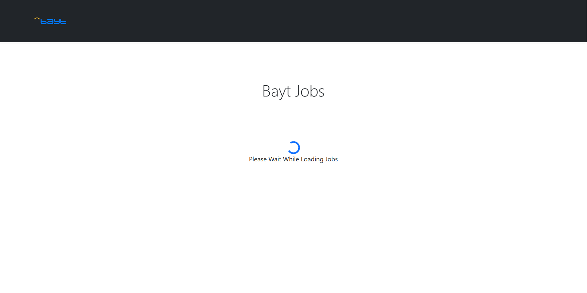
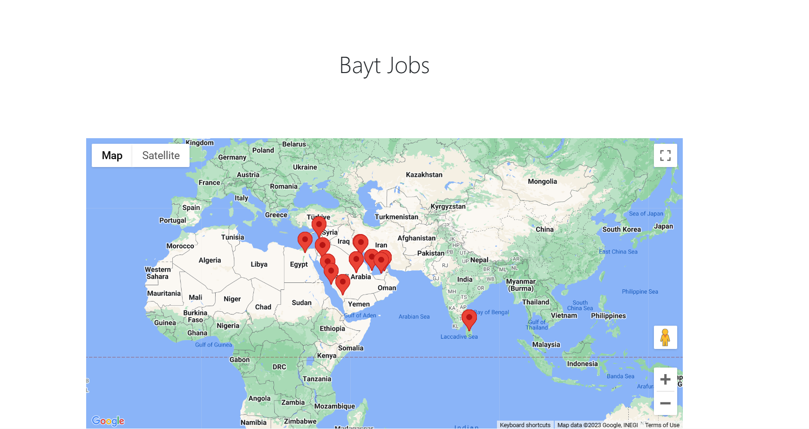
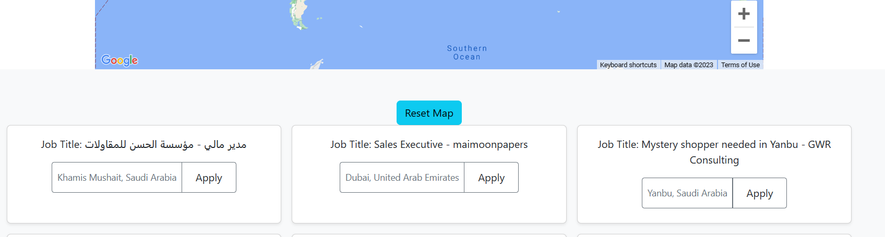

# Nodejs Rss Feed Parser
# Technologies used
- Backend: Nodejs, rss-parser library
- Frontend: HTML5 , CSS , Bootstrap 5, Vanilla Javascript


# Pre-requisites
- Install [Node.js](https://nodejs.org/en/) version +16


# Getting started
- Clone the repository
```
git clone  https://github.com/MahmoudNehro/Rss-Parser-NodeJs
```
- Install dependencies
```
cd <project>\Backend
npm install
```
- Run the Backend
```
npm start
```
- Run the Frontend
```
cd <project>\Frontend
Open index.html
```

## Project preview



